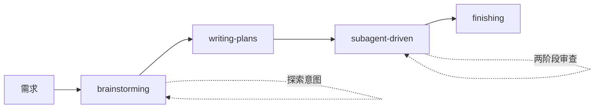
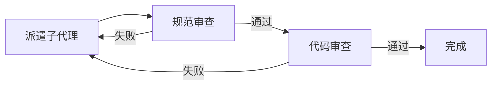
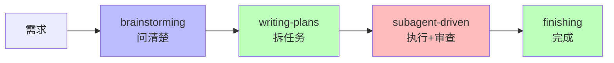

# Superpowers

## AI 编码超能力

<span class="text-lg op-70">让 AI 真正帮你完成任务，而不是陪你聊天</span>

---
transition: fade
---

# AI 编程的困境

| 痛点    | 表现                |
|-------|-------------------|
| 上下文污染 | AI 越聊越乱，代码质量下降    |
| 随机修复  | 试了这个再试那个，越改越烂     |
| 跳过测试  | "手动测了" —— 上线崩了    |
| 一次做太多 | 同时改 20 个文件，不知改了什么 |

**解决思路：把 AI 的能力框在流程里**

<v-click>

## SuperPowers 的核心价值

**将软件工程最佳实践自动化，强制 AI 从"鲁莽执行者"转变为"严谨工程师"**

</v-click>

<v-click>

- 设计先行 → 不写没有设计文档的代码
- TDD → 不写没有失败测试的代码
- 代码审查 → 不写没有审查通过的代码

</v-click>

<v-click>

**显著提升代码质量和逻辑一致性**

</v-click>

<!--
  逻辑顺序：困境 → 解决思路 → 核心价值
  衔接点："解决思路"抛出问题，"核心价值"作为回答
-->

---
transition: fade
---

# 三个铁律

<v-click>

**1. brainstorming 之前不写代码**
> "这太简单了，不需要设计" —— 简单项目是浪费工作最多的地方

</v-click>

<v-click>

**2. 写代码之前先写测试**
> 没有先失败的测试，就没有生产代码

</v-click>

<v-click>

**3. 调试之前先找根因**
> 随机修复浪费时间并创造新错误

</v-click>

<!--
  逻辑顺序：三个铁律 → 工作流（具象化）
  衔接点：铁律是抽象原则，工作流是具体落地
-->

---
transition: slide-up
---

# 工作流

<!--
  开发前准备：使用 Git Worktree 创建隔离工作空间
  技术：git worktree add <新分支> <路径>
  目的：为每个任务创建独立的沙箱，防止未完成或错误的代码污染主分支
-->



**每个阶段产出的文档是下一阶段的输入**

---
transition: slide-left
---

# brainstorming：问清楚再动手

<!--
  核心理念："先想后做"
  过程：苏格拉底式对话 → 提炼需求文档 → 制定开发计划
  这三个阶段（brainstorming + writing-plans）完整实现"先想后做"
-->

<v-click>

**苏格拉底式对话**：一次一个问题，澄清模糊想法

</v-click>

<v-click>

**提炼需求文档**：将模糊需求转化为清晰规范

</v-click>

<v-click>

**制定开发计划**：基于规范拆解为可执行任务

</v-click>

<!--
  逻辑顺序：brainstorming 核心理念 → 流程
  衔接点：理念是 WHY，流程是 HOW
-->

## 流程

1. 探索项目上下文
2. **一次一个问题**澄清需求
3. 提出 2-3 个方案（含权衡）
4. 呈现设计 → 获得批准
5. 写设计文档 → 保存提交

## 硬规则

```markdown
<HARD-GATE>
在展示设计并获得用户批准之前，不写任何代码
</HARD-GATE>
```

<!--
  逻辑顺序：brainstorming 流程 → 检查清单（实践指南）
  衔接点：检查清单是流程的操作化版本
-->

---
transition: fade
---

# brainstorming：检查清单

<!--
  入口标记："唯一出口 → writing-plans"
  强调 brainstorming 必须有明确输出才能进入下一阶段
-->

<v-clicks>

- [ ] 探索上下文：文件、文档、最近提交
- [ ] 澄清问题：目的、约束、成功标准
- [ ] 提出方案：2-3 个，含权衡和建议
- [ ] 呈现设计：按复杂度分节，每节确认
- [ ] 编写规范：保存到 `docs/superpowers/specs/`
- [ ] 规范自审：占位符、矛盾、歧义、范围
- [ ] 用户审查：等用户批准后再继续

</v-clicks>

**最终状态：调用 writing-plans（唯一出口）**

<!--
  逻辑顺序：brainstorming → writing-plans
  衔接点：设计文档是输入，任务列表是输出
-->

---
transition: slide-up
---

# writing-plans：把设计变成任务

<!--
  逻辑顺序：writing-plans 原则 → 任务结构示例
  衔接点：原则是抽象规则，示例是具体呈现
-->

## 核心原则

<v-click>

**文件结构先行** —— 映射创建/修改的文件及职责

</v-click>

<v-click>

**小任务粒度** —— 每步 2-5 分钟，包含完整代码

> 细粒度便于管理和验证，一旦出错能立即发现并修正，避免在错误方向上堆积 Bug

</v-click>

<v-click>

**TDD 导向** —— 失败测试 → 最小实现 → 通过 → 提交

> **红-绿-重构循环**：
> - 🔴 红：编写失败测试
> - 🟢 绿：编写最小代码使测试通过
> - 🔵 重构：优化代码质量

</v-click>

<v-click>

**无占位符** —— 不要写"TBD"、"类似任务 N"、"添加错误处理"

</v-click>

<!--
  逻辑顺序：writing-plans 原则 → 任务结构示例
  衔接点：原则是抽象规则，示例是具体呈现
-->

---
transition: fade
---

# writing-plans：任务结构

<!--
  TDD 循环的关键体现：测试失败 → 实现 → 测试通过
  每个步骤都要求完整代码，避免"先写后面再补测试"
-->

```markdown
### 任务 N：用户认证组件

**文件：**

- 创建：`src/auth/login.ts`
- 修改：`src/auth/index.ts:1-20`
- 测试：`tests/auth/login.test.ts`

- [ ] **步骤 1：写失败的测试**
- [ ] **步骤 2：运行验证失败**
- [ ] **步骤 3：写最小实现**
- [ ] **步骤 4：运行验证通过**
- [ ] **步骤 5：提交**
```

**每步：完整代码 + 精确命令 + 预期输出**

---
transition: slide-left
---

# subagent-driven：执行计划

<!--
  核心理念："子代理驱动开发"
  定义：为每个小任务派遣一个独立的子代理执行，完成后即离开
  优点：避免上下文污染，就像每次都在一张白纸上工作
-->

<v-click>

**什么是子代理驱动开发？**

每个小任务派遣一个独立的子代理 → 执行完成 → 离开

</v-click>

<v-click>

**核心优点：避免上下文污染**

不受之前任务残留信息的影响，每次都是"新鲜开始"

</v-click>

<!--
  逻辑顺序：概念定义 → 任务循环流程图
  衔接点：mermaid 图展示具体执行流程
-->

## 任务循环



## 两轮审查

<v-click>

**1. 规格审查** —— 确保需求实现

</v-click>

<v-click>

**2. 代码质量审查** —— 确保代码规范

</v-click>

---
transition: fade
---

# subagent-driven：关键原则

<v-clicks>

- 每个任务一个**新鲜子代理**（无上下文污染）
- 审查发现问题 → 修复 → **重新审查**
- 模型选择：
    - 机械实施 → 快速廉价模型
    - 集成判断 → 标准模型
    - 架构审查 → 最强模型
- **永远不要**并行派遣多个实施子代理

</v-clicks>

<!--
  逻辑顺序：subagent-driven 执行 → systematic-debugging（调试时切入）
  衔接点：subagent-driven 强调"不鲁莽"，debugging 强调"找根因"
  这是两个不同场景，但都是铁律的延伸
-->

---
transition: slide-up
---

# systematic-debugging：找根因

<!--
  核心原则："先找根本原因再修复"
  方法：阅读错误信息 → 模式识别 → 假设测试 → TDD 修复
  这是"调试之前先找根因"铁律的具体落地
-->

<v-click>

**核心原则：先找根本原因再修复**

</v-click>

<v-click>

**方法论：分析错误信息 → 模式识别 → 假设测试 → TDD 修复**

</v-click>

<!--
  逻辑顺序：核心原则 → 四个阶段
  衔接点：原则是 WHY，阶段是 HOW
-->

## 四个阶段

| 阶段      | 做什么          | 关键        |
|---------|--------------|-----------|
| 1. 根因调查 | 读错误、重现、检查变化  | 理解什么和为什么  |
| 2. 模式分析 | 找类似代码、比较差异   | 识别差异      |
| 3. 假设测试 | 形成假设、最小化测试   | 一次一个变量    |
| 4. 实施   | 创建失败测试、修复、验证 | 修复根因，不是症状 |

---
transition: fade
---

# systematic-debugging：铁律

```markdown
没有根本原因调查，就没有修复
```

<v-click>

**红旗 —— 停止并遵循流程**

- "先试试这个，看看是否有效"
- "跳过测试，我会手动验证"
- "再试一次修复"（当已经尝试了 2+ 次）

</v-click>

<v-click>

**如果 3+ 修复失败**：质疑架构，不是继续修

</v-click>

<!--
  逻辑顺序：systematic-debugging → finishing
  衔接点：调试完成后进入完成阶段
  过渡效果：slide-left 从左侧滑入
-->

---
transition: slide-left
---

# finishing：完成工作

<!--
  核心原则：测试失败 = 停止
  这是 TDD 铁律的最终保障
-->

<!--
  逻辑顺序：finishing → 总结
  衔接点：从具体流程回归全局视角
  过渡效果：slide-up 从下方升起
-->

## 流程

1. **验证测试** —— 确保测试通过再继续
2. **呈现选项**：
    - 本地合并回基准分支
    - 推送并创建 PR
    - 保持分支不变
    - 放弃工作
3. **执行选择**
4. **清理工作树**

**测试失败？停止。不要继续。**

<!--
  逻辑顺序：finishing → 总结
  衔接点：从具体流程回归全局视角
  过渡效果：slide-up 从下方升起
-->

---
transition: slide-up
---

# 总结：Superpowers 工作流

<!--
  mermaid 图回归：强化工作流的全局认知
  表格总结：每个阶段的核心产出（呼应开头的困境表格）
-->



| 阶段              | 核心产出    |
|-----------------|---------|
| brainstorming   | 设计规范    |
| writing-plans   | 实施计划    |
| subagent-driven | 审查通过的代码 |
| finishing       | 合并选项    |

<!--
  逻辑顺序：总结 → 记住三个铁律
  衔接点：从结构化知识回归核心记忆点
  呼应开头："三个铁律"幻灯片
  过渡效果：center 居中聚焦
-->

---
transition: center
---

# 记住三个铁律

<!--
  首尾呼应：
  - 开篇：三个铁律（引入问题解决的框架）
  - 结尾：三个铁律（强化核心记忆点）
-->

1. **设计之前不写代码** —— 即使"很简单"
2. **代码之前先写测试** —— 测试先失败再通过
3. **修复之前先找根因** —— 不然越修越乱

把 AI 的能力框在流程里

<!--
  逻辑顺序：记住三个铁律 → 开始使用
  衔接点：从认知转向行动
  收尾语呼应开篇：把 AI 的能力框在流程里
-->

---
layout: center
class: text-center
---

# 开始使用

<!--
  结尾三要素：
  1. 行动入口：git clone
  2. 关键路径：skills/ 目录
  3. 核心提示：从 brainstorming 开始
-->

```bash
# 克隆项目
git clone https://github.com/superpowers/superpowers.git

# 查看 skills 目录
ls skills/

# 安装 skills 到全局
npx skills add https://github.com/superpowers/superpowers.git -g
```

从 brainstorming 开始，每次一个任务
