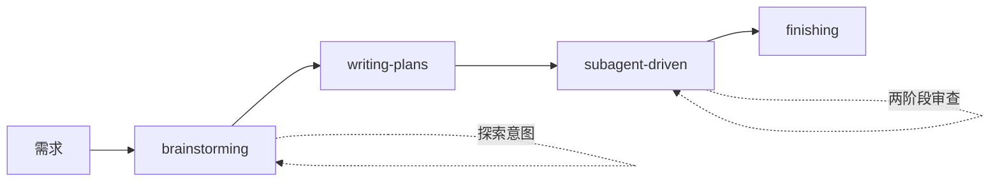
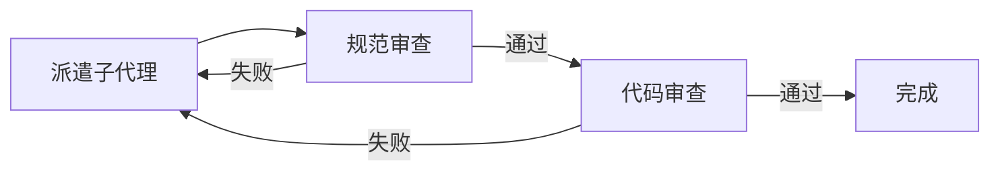
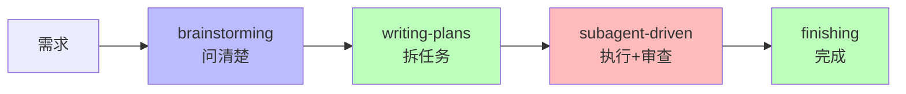

# AI 编程的困境

| 痛点 | 表现 |
|------|------|
| 上下文污染 | AI 越聊越乱，代码质量下降 |
| 随机修复 | 试了这个再试那个，越改越烂 |
| 跳过测试 | "手动测了" —— 上线崩了 |
| 一次做太多 | 同时改 20 个文件，不知改了什么 |

**解决思路：把 AI 的能力框在流程里**

---
transition: fade
---

# 三个铁律

<v-click>

**1. brainstorming 之前不写代码**
> "这太简单了，不需要设计" —— 简单项目是浪费工作最多的地方

</v-click>

<v-click>

**2. 写代码之前先写测试**
> 没有先失败的测试，就没有生产代码

</v-click>

<v-click>

**3. 调试之前先找根因**
> 随机修复浪费时间并创造新错误

</v-click>

---
transition: slide-up
---

# 工作流



**每个阶段产出的文档是下一阶段的输入**

---
transition: slide-left
---

# brainstorming：问清楚再动手

## 流程

1. 探索项目上下文
2. **一次一个问题**澄清需求
3. 提出 2-3 个方案（含权衡）
4. 呈现设计 → 获得批准
5. 写设计文档 → 保存提交

## 硬规则

```markdown
<HARD-GATE>
在展示设计并获得用户批准之前，不写任何代码
</HARD-GATE>
```

---
transition: fade
---

# brainstorming：检查清单

<v-clicks>

- [ ] 探索上下文：文件、文档、最近提交
- [ ] 澄清问题：目的、约束、成功标准
- [ ] 提出方案：2-3 个，含权衡和建议
- [ ] 呈现设计：按复杂度分节，每节确认
- [ ] 编写规范：保存到 `docs/superpowers/specs/`
- [ ] 规范自审：占位符、矛盾、歧义、范围
- [ ] 用户审查：等用户批准后再继续

</v-clicks>

**最终状态：调用 writing-plans（唯一出口）**

---
transition: slide-up
---

# writing-plans：把设计变成任务

## 核心原则

<v-click>

**文件结构先行** —— 映射创建/修改的文件及职责

</v-click>

<v-click>

**小任务粒度** —— 每步 2-5 分钟，包含完整代码

</v-click>

<v-click>

**TDD 导向** —— 失败测试 → 最小实现 → 通过 → 提交

</v-click>

<v-click>

**无占位符** —— 不要写"TBD"、"类似任务 N"、"添加错误处理"

</v-click>

---
transition: fade
---

# writing-plans：任务结构

```markdown
### 任务 N：用户认证组件

**文件：**
- 创建：`src/auth/login.ts`
- 修改：`src/auth/index.ts:1-20`
- 测试：`tests/auth/login.test.ts`

- [ ] **步骤 1：写失败的测试**
- [ ] **步骤 2：运行验证失败**
- [ ] **步骤 3：写最小实现**
- [ ] **步骤 4：运行验证通过**
- [ ] **步骤 5：提交**
```

**每步：完整代码 + 精确命令 + 预期输出**

---
transition: slide-left
---

# subagent-driven：执行计划

## 任务循环



## 两阶段审查

<v-click>

**1. 规范合规性** —— 满足需求？无多余？

</v-click>

<v-click>

**2. 代码质量** —— 测试覆盖？命名清晰？

</v-click>

---
transition: fade
---

# subagent-driven：关键原则

<v-clicks>

- 每个任务一个**新鲜子代理**（无上下文污染）
- 审查发现问题 → 修复 → **重新审查**
- 模型选择：
  - 机械实施 → 快速廉价模型
  - 集成判断 → 标准模型
  - 架构审查 → 最强模型
- **永远不要**并行派遣多个实施子代理

</v-clicks>

---
transition: slide-up
---

# systematic-debugging：找根因

## 四个阶段

| 阶段 | 做什么 | 关键 |
|------|--------|------|
| 1. 根因调查 | 读错误、重现、检查变化 | 理解什么和为什么 |
| 2. 模式分析 | 找类似代码、比较差异 | 识别差异 |
| 3. 假设测试 | 形成假设、最小化测试 | 一次一个变量 |
| 4. 实施 | 创建失败测试、修复、验证 | 修复根因，不是症状 |

---
transition: fade
---

# systematic-debugging：铁律

```markdown
没有根本原因调查，就没有修复
```

<v-click>

**红旗 —— 停止并遵循流程**

- "先试试这个，看看是否有效"
- "跳过测试，我会手动验证"
- "再试一次修复"（当已经尝试了 2+ 次）

</v-click>

<v-click>

**如果 3+ 修复失败**：质疑架构，不是继续修

</v-click>

---
transition: slide-left
---

# finishing：完成工作

## 流程

1. **验证测试** —— 确保测试通过再继续
2. **呈现选项**：
   - 本地合并回基准分支
   - 推送并创建 PR
   - 保持分支不变
   - 放弃工作
3. **执行选择**
4. **清理工作树**

**测试失败？停止。不要继续。**

---
transition: slide-up
---

# 总结：Superpowers 工作流



| 阶段 | 核心产出 |
|------|----------|
| brainstorming | 设计规范 |
| writing-plans | 实施计划 |
| subagent-driven | 审查通过的代码 |
| finishing | 合并选项 |

---
transition: center
---

# 记住三个铁律

1. **设计之前不写代码** —— 即使"很简单"
2. **代码之前先写测试** —— 测试先失败再通过
3. **修复之前先找根因** —— 不然越修越乱

把 AI 的能力框在流程里

---
layout: center
class: text-center
---

# 开始使用

```bash
# 克隆项目
git clone https://github.com/superpowers/superpowers.git

# 查看 skills 目录
ls skills/
```

从 brainstorming 开始，每次一个任务

<PoweredBySlidev mt-10 />
